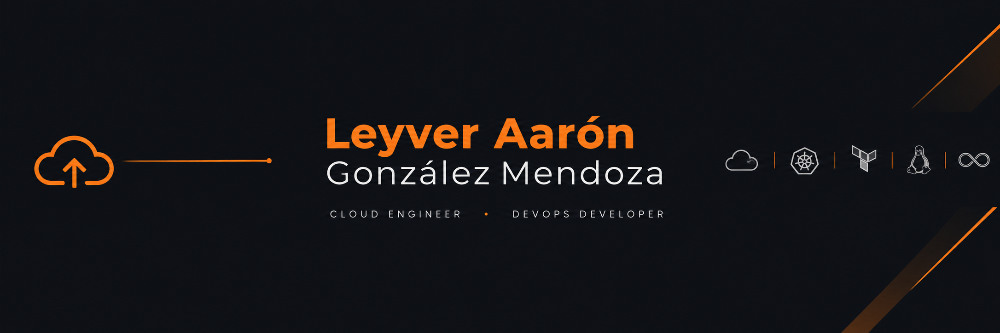
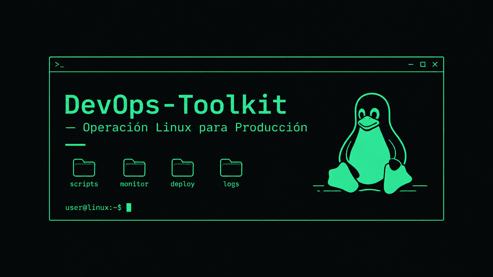

<div align="center">




<br/>

<a href="https://www.linkedin.com/in/leyver-aaron-gonzalez-mendoza-7026a73a8/">

</a>
<a href="mailto:gonzalezleyver6@gmail.com">

</a>
<a href="https://github.com/CodeWhiteWeb">

</a>

<br/>


</div>

---

## `> whoami`

Ingeniero en Tecnologías de la Información especializado en **diseño, automatización y despliegue de infraestructura cloud escalable**. 

<table>
  <tr>
    <td align="center" width="20%">
      
      <br/>
      <strong>Linux para servidor</strong>
      <br/>
      <sub>Scripts bash</sub>
    </td>
    <td align="center" width="20%">
      
      <br/>
      <strong>2.º lugar nacional</strong>
      <br/>
      <sub>Huawei Academy Cloud</sub>
    </td>
    <td align="center" width="20%">
      
      <br/>
      <strong>Cloud híbrida</strong>
      <br/>
      <sub>AWS + GCP</sub>
    </td>
  </tr>
</table>


Mi enfoque consiste en transformar procesos manuales en flujos automatizados mediante **Infrastructure as Code, contenedores, CI/CD, Linux y herramientas de observabilidad**.


## `> stack --overview`

<table>
  <tr>
    <td align="center" width="25%"><strong>Cloud & Infra</strong><br/><br/><br/><sub>AWS · GCP · Terraform</sub></td>
    <td align="center" width="25%"><strong>Containers</strong><br/><br/><br/><sub>Docker · Kubernetes</sub></td>
    <td align="center" width="25%"><strong>CI/CD & Git</strong><br/><br/><br/><sub>GitHub Actions · GitHub</sub></td>
    <td align="center" width="25%"><strong>Observability</strong><br/><br/><br/><sub>Prometheus · Grafana</sub></td>
  </tr>
</table>
<table>
  <tr>
    <td align="center" width="25%"><strong>Lenguajes de programacion</strong><br/><br/><br/><sub>Python · Bash · Java</sub></td>
    <td align="center" width="25%"><strong>Base de datos</strong><br/><br/><br/><sub>MySQL · Firebase · Postgres</sub></td>
  </tr>
</table>
<br>

## `> projects --featured`

### `01` · DevOps-Toolkit

**Operación Linux para producción**



Toolkit orientado a la administración y automatización de infraestructura Linux mediante herramientas de línea de comandos.

**Enfoque**

```text
Linux
 ├── System Administration
 ├── Bash Automation
 ├── Infrastructure Operations
 └── Production Utilities
```

<p>


</p>

**Repository:**
https://github.com/leyverAAA/DevOps-Toolkit

---

### `02` · Monitoring & Observability

**Monitoreo de infraestructura y servicios**

Proyecto enfocado en visualizar el estado de servicios mediante métricas y dashboards.

```text
Service
 └── Prometheus
    └── Metrics
       └── Grafana
          └── Dashboards
```


<p>


</p>

**Repository:**
https://github.com/CodeWhiteWeb/REPO_NAME

---

### `03` · Infrastructure Automation

**Infraestructura reproducible mediante código**

Exploración práctica de automatización de infraestructura cloud utilizando Terraform y servicios de AWS/GCP.


<p>


</p>

---

## `> philosophy`

La automatización no consiste únicamente en reducir comandos manuales.

Se trata de construir sistemas donde los procesos puedan ser:

**repetidos → medidos → entendidos → mejorados.**

---

## `> achievements`

<div align="center">


<br/><br/>

**Huawei Academy Cloud Competition**

**2.º lugar nacional**

</div>

---

## `> github --activity`

<p align="center">

</p>

---

## `> interests`

<p align="center">


</p>

---

## `> currently_learning`

```bash
leyver@cloud:~$ learning --now

[■■■■■■■■■■] Cloud Engineering
[■■■■■■■■■□] DevOps
[■■■■■■■■■□] Linux & Automation
[■■■■■■■□□□] Kubernetes
[■■■■■■□□□□] Observability

```

Mi objetivo es continuar evolucionando hacia un perfil capaz de **diseñar, automatizar, desplegar y operar infraestructura cloud moderna**.

---

## `> contact --open`

Estoy abierto a oportunidades, proyectos y colaboraciones relacionadas con:

**Cloud Engineering · DevOps · Infrastructure · Automation**

<p align="center">

<a href="https://www.linkedin.com/in/leyver-aaron-gonzalez-mendoza-7026a73a8/">

</a>

</p>

---

<div align="center">

```text
┌───────────────────────────────────────────┐
│                                           │
│  BUILD  •  AUTOMATE  •  OBSERVE  • SCALE  │
│                                           │
└───────────────────────────────────────────┘
```

### **“La tecnología puede automatizar procesos; la curiosidad y la disciplina impulsan la evolución.”**

<br/>


</div>
